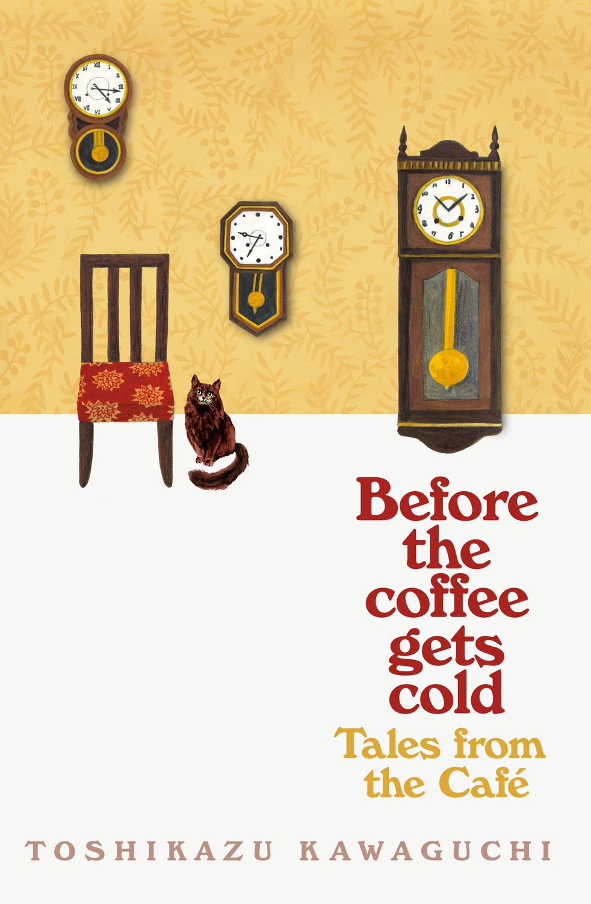

# BOOKS 

# Book 1
### Before the coffee gets cold

Before the coffee gets cold is a captivating Japanese novel by Toshikazu Kawaguchi. It revolves around a mysterious café in Tokyo that offers a unique experience: the chance to travel back in time.    
 * The café has been serving carefully brewed coffee for over a century.  
 * Customers can travel to the past, but there are rules: they must sit in a specific seat, cannot leave the café, and must return before their coffee gets cold.  
 * The novel follows four visitors, each with a different purpose: confronting a lost love, receiving a sister one last time, and meeting a daughter they never knew. 
   
The book explores themes of regret, love, and fate. If you enjoy magical realism and heartfelt stories, this is one is worth to read. 
# Book 2
### It ends with us

It Ends With Us is a powerful romance novel by Colleen Hoover. It delves into complex relationships and the impact of abuse. "The novel has sold over one million copies worldwide and been translated into over twenty languages".  
 The story revolves around Lily Bloom, a college graduate who moves to Boston with dreams of opening her own floral shop. She meets Ryle Kincaid with whom she starts a relationship. Lily's part includes a childhood friendship with Atlas Corrigan, which was cut short due to her abusive father. As Lily and Ryle's relationship unfolds, they face challenges, including Ryle's anger issues resurfacing. Lily discovers she's pregnant with Ryle's child but keeps it a secret.  
# Book 3
### Harry Potter and the Sorcerer's Stone (Book 1)

In J.k Rowling's novel, we followed the journey of Harry Potter, a young orphan living with his cruel aunt and uncle. On his eleventh birthday, everything changes when he receives an unexpected letter, a letter that reveals his true identity as a wizard. Harry is soon admitted to Hogwarts, where he embarks on an adventure filled with magic, danger and friendships.  
 The novel introduces reader to a fully realized wizarding universe, complete with magical creatures and spells. As Harry navigates his first year at Hogwarts, he uncovers secrets about his past, the death of his parents, and Lord Voldemort. The story sets the stage for Harry's epic journey.

Bibliografía:
* https://en.wikipedia.org/wiki/Harry_Potter#:~:text=Harry%20Potter%20is%20a%20series%20of%20seven%20fantasy%20novels%20written
* https://www.goodreads.com/book/show/27362503-it-ends-with-us
* https://www.bing.com/search?q=before+the+cofee+gets+cold&cvid=fa5144f719594411a4cceb535632e4b0&gs_lcrp=EgZjaHJvbWUyBggAEEUYOTIGCAEQABhAMgYIAhAAGEAyBggDEAAYQDIGCAQQABhAMgYIBRAAGEAyBggGEAAYQDIGCAcQABhAMgYICBAAGEDSAQkxMDE1NGowajSoAgCwAgA&FORM=ANAB01&PC=ASTS
* https://en.wikipedia.org/wiki/It_Ends_with_Us