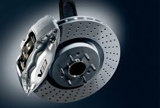
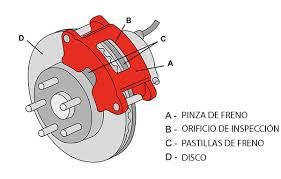
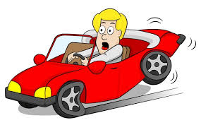

# frenos
## ¿que hacen?
frenan el auto

## ¿para que se usan?
para no chocar

## ¿todos los autos lo tienen?
si

## ¿de que color son las pastillas de freno?
casi siempre son de color plata pero pueden ser de otros colores

### colores de pastilla de freno

- rojo
- verde
- plata
### bibliografia

- https://www.mitsubishi-motors.com.pe/blog/funcionamiento-sistema-frenos-vehiculo/
- https://www.mitsubishi-motors.com.pe/blog/debes-saber-pastillas-freno/#:~:text=Las%20pastillas%20de%20freno%20aplican,tambi%C3%A9n%20lo%20hacen%20las%20ruedas.
- https://www.spgtalleres.com/es/noticias/tipos-pastillas-freno/_id:198/
- https://www.euromaster-neumaticos.es/blog/la-importancia-del-sistema-de-frenos#:~:text=El%20sistema%20de%20frenos%20nos,y%20aprender%20a%20adelantarnos%20a
- https://www.onroad.to/practico/aprender-conducir/frenar-coche
